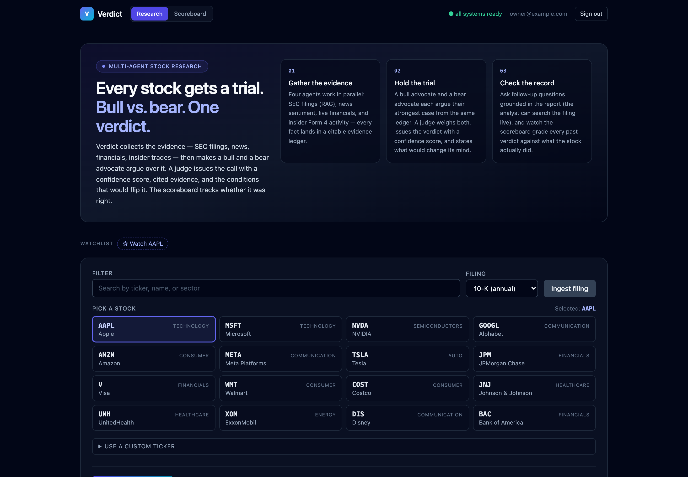
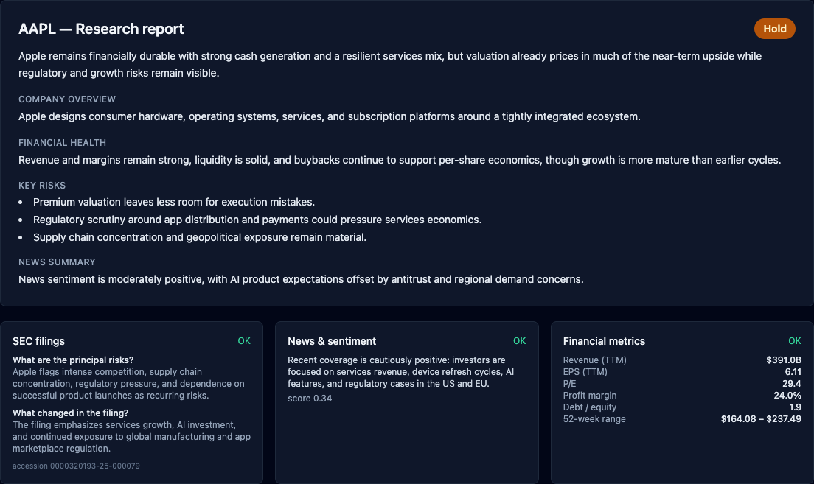
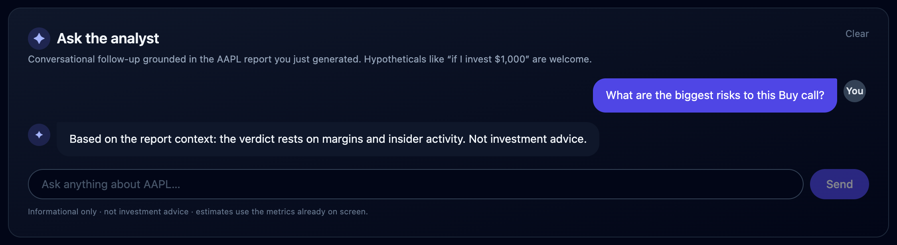

# Verdict

[](https://www.python.org/)
[](https://nodejs.org/)
[](https://fastapi.tiangolo.com/)
[](https://langchain-ai.github.io/langgraph/)
[](https://react.dev/)
[](LICENSE)

Verdict is a full-stack, multi-agent equity research workspace. Enter a ticker,
optionally index the latest SEC filing, run a parallel research graph, and get a
grounded Buy / Hold / Sell report with live progress, cost tracking, run
history, and a follow-up analyst chat.

> Verdict is a software demo and research workflow exploration tool. It is not
> financial advice.



## Product Tour

### Research Workspace

Verdict starts with a protected research dashboard: stock picker, watchlist,
SEC filing ingestion, ad-hoc filing search, live backend readiness, and a
streamed "put it on trial" run button.

### The Trial

Each run gathers evidence in parallel (SEC filing RAG, news sentiment, live
financials, insider Form 4 activity) into a citable evidence ledger. A bull
advocate and a bear advocate then each argue their strongest case from that
ledger, and a judge weighs both to issue the verdict — with a 0-100 confidence
score, a five-dimension scorecard, the strongest opposing argument it
overruled, and concrete falsifiers that would flip the call. Every claim cites
evidence ids you can click open in the UI.



### Ask The Analyst

After a report is generated, Verdict opens a contextual chat grounded in that
run. The analyst can also search the indexed filing live (LLM tool use) when a
follow-up needs detail the report doesn't carry.



### The Scoreboard

Every verdict stores the price at the moment it was issued. The scoreboard tab
replays the book: forward return since each call, hit/miss under a disclosed
rule, aggregate hit rate, and average return on Buys. Verdict grades its own
homework.

Screenshots above use sample AAPL documentation data captured from the real
React UI with mocked API responses.

## What It Does

- Small-circle multi-user: the bootstrap owner mints one-time invite codes
  (7-day expiry, digest-only storage); friends register with a code — no email
  service required. Password auth, optional TOTP 2FA, HttpOnly sessions, CSRF
  protection, origin checks, and rate limits for every account.
- Free-tier protection built in: research runs are communal — a recent run for
  a ticker is served to everyone from cache (zero LLM cost), and fresh runs
  are capped per user and globally per day (`DAILY_RUNS_PER_USER`,
  `DAILY_RUNS_GLOBAL`, `RESEARCH_CACHE_MINUTES`).
- One-button analysis for stocks AND crypto: pick an asset, pick a holding
  period (1 week to 1 year), press Analyze. The filing is fetched and indexed
  automatically on first run; coins skip SEC/insider evidence with a plain
  explanation.
- Horizon-aware verdicts: the debate and judge are framed for the user's
  window, with rolling-window stats (typical swing, best/worst stretch) from a
  year of price history, a "$100 for 2 weeks" outlook card, and an
  "Explain it simply" mode with zero finance jargon.
- Fetches the latest SEC `10-K` or `10-Q` for a ticker through SEC EDGAR.
- Chunks filing text, embeds it with OpenAI embeddings, and stores vectors in a
  local SQLite vector store by default (or Pinecone when a key is set).
- Runs a LangGraph adversarial research graph:
  - four parallel evidence agents — SEC filing RAG, LLM-scored news sentiment,
    yfinance financials, and SEC Form 4 insider activity
  - a deterministic evidence ledger with citable ids
  - bull and bear advocates that argue opposing cases from the same ledger
  - a judge that issues the verdict with confidence, dimension scores,
    dissent, falsifiers, and evidence citations — and may run one targeted
    follow-up retrieval from the filing before deciding
- Streams per-node progress and mid-debate events to the browser over SSE.
- Persists completed runs (with price-at-verdict) in SQLite for history,
  verdict-drift timelines, and the self-grading scoreboard.
- Tracks prompt, completion, embedding, and estimated USD cost per request.

Verdict degrades intentionally. Missing NewsAPI credentials skip the news
agent. Missing filing vectors skip the SEC RAG path. Upstream failures return
typed error payloads instead of taking down the whole graph — the judge rules
on whatever evidence survives.

## Architecture

```text
React + TypeScript + Vite
  auth gate, watchlist, SSE trial progress, verdict card, debate panel,
  evidence ledger, scorecard radar, timeline, scoreboard, analyst chat
        |
        | REST + Server-Sent Events
        v
FastAPI
  auth, 2FA, CSRF, rate limits, readiness, JSON logs, persistence
        |
        v
LangGraph StateGraph
  START
    |-----------|-------------|--------------|
    v           v             v              v
  SEC agent   News agent    Metrics agent  Insider agent
  local RAG   NewsAPI +     yfinance       EDGAR Form 4
  (or         LLM scoring
  Pinecone)
    |-----------|------|------|--------------|
                       v  join
                 evidence ledger  (citable ids: sec:0, metrics:pe, …)
                   |         |
                   v         v
              bull advocate  bear advocate
                   |         |
                   v  join   v
                     judge  ── may loop once for a follow-up retrieval
              verdict + confidence + scores + dissent + falsifiers
                       |
                       v
              SQLite research_runs (with price-at-verdict → scoreboard)
```

## Tech Stack

| Layer | Tools |
| --- | --- |
| Frontend | React 18, TypeScript, Vite, Tailwind CSS |
| API | FastAPI, Uvicorn, Gunicorn, SlowAPI, SSE Starlette |
| Agents | LangGraph `StateGraph` |
| LLM | Any OpenAI-compatible chat completion endpoint |
| Embeddings | OpenAI embeddings |
| Retrieval | Local SQLite vector store (default) or Pinecone serverless |
| Market and news data | SEC EDGAR (filings + Form 4), NewsAPI, yfinance |
| Sentiment | Batched LLM scoring (finance-aware, per headline) |
| Persistence | SQLAlchemy async ORM, SQLite by default |
| Security | Argon2id, encrypted TOTP seed, one-time recovery codes, CSRF |
| Ops | Docker, Docker Compose, nginx SPA proxy, structured JSON logs |
| Tests | pytest, pytest-asyncio, pytest-httpx, ruff, TypeScript build |

## Repository Layout

```text
Verdict/
├── backend/
│   ├── app/
│   │   ├── agents/              # LangGraph state and agent nodes
│   │   ├── observability/       # JSON logging and token/cost tracking
│   │   ├── persistence/         # async SQLAlchemy history store
│   │   ├── routers/             # auth, health, filings, research
│   │   ├── schemas/             # Pydantic request/response models
│   │   ├── services/            # SEC, Pinecone, LLM, embeddings, news, metrics
│   │   └── tests/               # mocked backend test suite
│   ├── Dockerfile
│   ├── Dockerfile.dev
│   └── requirements.txt
├── frontend/
│   ├── src/
│   │   ├── api/client.ts        # typed REST and SSE client
│   │   ├── components/          # auth, picker, report, chat, history
│   │   └── App.tsx
│   ├── Dockerfile
│   ├── Dockerfile.dev
│   └── nginx.conf
├── docs/assets/                 # README screenshots
├── docker-compose.yml
├── docker-compose.dev.yml
├── .env.example
└── Makefile
```

## Quickstart

### 1. Configure Environment

```bash
cp .env.example .env
```

Fill in the required security and SEC settings:

```bash
SEC_USER_AGENT="Verdict Research your.email@example.com"
AUTH_BOOTSTRAP_TOKEN="$(openssl rand -base64 48)"
AUTH_ENCRYPTION_KEY="$(python -c 'import base64, os; print(base64.urlsafe_b64encode(os.urandom(32)).decode())')"
```

Then choose your model provider.

For Gemini through its OpenAI-compatible endpoint, keep the default
`LLM_BASE_URL` and set:

```bash
LLM_API_KEY=...
LLM_MODEL=gemini-2.5-flash
```

For OpenAI chat, leave `LLM_BASE_URL` blank and set:

```bash
OPENAI_API_KEY=...
LLM_MODEL=gpt-4o-mini
```

SEC filing search requires `OPENAI_API_KEY` for embeddings. Vectors live in a
local SQLite file by default — no other service needed. Set `PINECONE_API_KEY`
only if you want the Pinecone serverless backend instead.

News sentiment is optional:

```bash
NEWS_API_KEY=...
```

### 2. Run With Docker

```bash
docker compose up --build
```

- App: http://localhost:8080
- Backend container: internal to the Compose network
- SQLite data: persisted in the `verdict-db` Docker volume

On first launch, the browser asks for `AUTH_BOOTSTRAP_TOKEN`, creates the owner
account, and requires TOTP enrollment. Save the recovery codes. The bootstrap
route closes permanently once the owner exists.

### 3. Run With Hot Reload

```bash
docker compose -f docker-compose.yml -f docker-compose.dev.yml up --build
```

- Vite frontend: http://localhost:5173
- FastAPI backend: http://localhost:8000
- API docs in development: http://localhost:8000/docs

## Configuration

| Variable | Required | Purpose |
| --- | --- | --- |
| `SEC_USER_AGENT` | Yes | SEC EDGAR contact user agent |
| `AUTH_BOOTSTRAP_TOKEN` | Yes | One-time owner creation secret |
| `AUTH_ENCRYPTION_KEY` | Yes | Fernet key used to encrypt the TOTP seed |
| `LLM_API_KEY` | For custom chat providers | Key for `LLM_BASE_URL` providers such as Gemini or Groq |
| `LLM_BASE_URL` | No | OpenAI-compatible chat endpoint; blank uses OpenAI |
| `OPENAI_API_KEY` | For SEC RAG and OpenAI chat | OpenAI embeddings and optional OpenAI chat |
| `PINECONE_API_KEY` | No | Switches the vector store from local SQLite to Pinecone |
| `VECTOR_DB_PATH` | No | Local vector store file; defaults to `./data/vectors.db` |
| `PINECONE_INDEX_NAME` | No | Defaults to `verdict-filings` |
| `NEWS_API_KEY` | No | Enables the news agent; missing key skips news |
| `EMBEDDING_MODEL` | No | Defaults to `text-embedding-3-small` |
| `DATABASE_URL` | No | Defaults to `sqlite+aiosqlite:///./data/verdict.db` |
| `CORS_ORIGINS` | No | Comma-separated browser origins |
| `SESSION_COOKIE_SECURE` | Production | Set to `true` behind HTTPS |
| `RATE_LIMIT_AUTH` | No | Defaults to `5/minute` |
| `RATE_LIMIT_RESEARCH` | No | Defaults to `30/minute` |
| `RATE_LIMIT_FILINGS` | No | Defaults to `60/minute` |

See [.env.example](.env.example) for the complete set of operational and cost
tracking variables.

## API Overview

| Method | Path | Purpose |
| --- | --- | --- |
| `GET` | `/health` | Public liveness probe |
| `GET` | `/health/ready` | Authenticated dependency readiness |
| `GET` | `/auth/status` | Bootstrap/login state |
| `POST` | `/auth/bootstrap` | One-time owner creation |
| `POST` | `/auth/login` | Password sign-in |
| `POST` | `/auth/2fa/verify` | TOTP or recovery-code verification |
| `POST` | `/filings/ingest` | Fetch, chunk, embed, and index the latest filing |
| `POST` | `/filings/query` | Search indexed filing chunks |
| `POST` | `/research/{ticker}` | Run the full adversarial research graph |
| `GET` | `/research/{ticker}/stream` | Stream node + debate progress and final result over SSE |
| `POST` | `/research/ask` | Contextual follow-up; can search the filing via tool use |
| `GET` | `/research/history/{ticker}` | Return recent persisted runs |
| `GET` | `/research/scoreboard` | Forward returns and hit rate for past verdicts |

Unauthenticated liveness check:

```bash
curl --fail http://localhost:8080/api/health
```

Use the browser client for protected routes. It manages the HttpOnly session,
the 2FA challenge, and the per-session CSRF token.

## Development Commands

Backend:

```bash
cd backend
python -m venv .venv
source .venv/bin/activate
pip install -r requirements-dev.txt
uvicorn app.main:app --reload
```

Frontend:

```bash
cd frontend
npm install
npm run dev
```

Checks:

```bash
cd backend
python -m ruff check app
python -m pytest -q

cd ../frontend
npm run lint
npm run build
```

Useful Make targets:

```bash
make dev
make backend-test
make frontend-install
make pinecone-init
make fetch-sample TICKER=AAPL
```

## Security Notes

- Real credentials belong in `.env`, which is ignored by git.
- `.env.example` contains placeholders only.
- Docker build contexts ignore `.env`, local virtualenvs, logs, caches, and
  build outputs.
- Runtime SQLite files under `backend/data/` or `data/` are ignored.
- Passwords use Argon2id.
- Session tokens are random, stored server-side only as SHA-256 digests, and
  delivered in HttpOnly/Secure/SameSite cookies.
- TOTP seeds are encrypted at rest.
- Recovery codes are one-time and keyed-hashed.
- Every non-health API route requires an authenticated, 2FA-verified session.
- State-changing requests require a per-session CSRF token and an allowed
  `Origin`.
- Research history is scoped to the authenticated owner.

Before publishing, scan for local secrets and databases:

```bash
find . -name ".env" -o -name "*.pem" -o -name "*.key" -o -name "*.db" -o -name "*.sqlite"
rg -n --hidden --glob '!.git/**' --glob '!frontend/node_modules/**' \
  --glob '!backend/.venv/**' --glob '!frontend/dist/**' \
  'sk-[A-Za-z0-9_-]{20,}|pcsk_[A-Za-z0-9_-]{20,}|ghp_[A-Za-z0-9]{20,}|github_pat_[A-Za-z0-9_]{20,}|AKIA[0-9A-Z]{16}|-----BEGIN [A-Z ]*PRIVATE KEY-----'
```

## Production Notes

- Set `ENVIRONMENT=production`, `DOCS_ENABLED=false`,
  `SESSION_COOKIE_SECURE=true`, and explicit `ALLOWED_HOSTS` / `CORS_ORIGINS`.
- Terminate TLS in a maintained reverse proxy or managed load balancer.
- Keep `APP_BIND_ADDRESS=127.0.0.1` when a local reverse proxy owns public TLS.
- Move from SQLite to Postgres for multi-instance deployments.
- Add shared rate-limit storage before scaling beyond one backend worker.
- Add provider budgets for LLM, embeddings, Pinecone, NewsAPI, and yfinance
  usage.
- Do not present model output as investment advice without human review and
  appropriate compliance controls.

## License

MIT. See [LICENSE](LICENSE).
